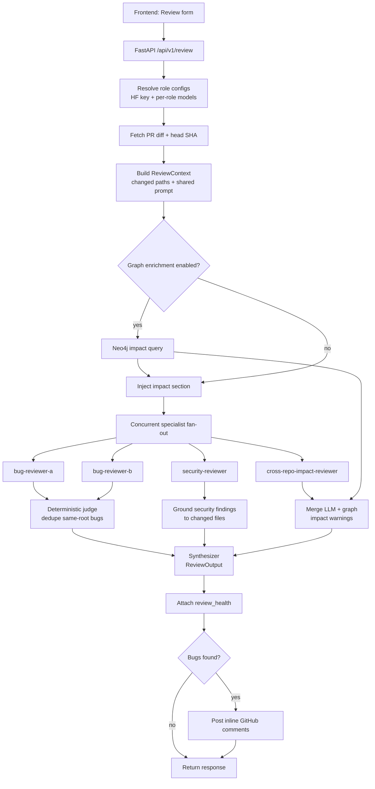

# PR Code Reviewer

Revisor automatizado de pull requests con **FastAPI**, **React** y un flujo determinístico de agentes [Agno](https://docs.agno.com). El sistema descarga el diff de un PR de GitHub, reparte el análisis entre especialistas, deduplica hallazgos, sintetiza una respuesta única y publica comentarios inline cuando encuentra bugs.

Opcionalmente integra un **Knowledge Graph en Neo4j** para detectar impacto cross-repo: si un PR toca un contrato, esquema o ruta consumida por otro servicio, el revisor lo advierte en el resultado.

## Qué hace hoy

- Ejecuta una revisión multi-agente con fan-out concurrente y roles fijos.
- Usa la ruta pública de **Hugging Face Router** para la UI, con modelos configurables por rol.
- Mantiene secretos en memoria del navegador y los envía solo para la request activa.
- Carga prompts desde Opik si está configurado; si no, usa fallbacks versionados en `prompts/`.
- Degrada de forma explícita cuando un agente falla, hace timeout o devuelve JSON inválido.
- Publica comentarios en GitHub exactamente una vez por revisión con hallazgos.

## Arquitectura

```text
┌─────────────────────┐   HTTP    ┌─────────────────────┐
│  Frontend           │──────────▶│  Backend            │
│  React/Nginx :8080  │           │  FastAPI :8000       │
│  (UI + form)        │◀──────────│  (API + reviewer)    │
└─────────────────────┘           └──────────┬──────────┘
                                             │ Bolt opcional
                                   ┌─────────▼──────────┐
                                   │  Neo4j Aura/local   │
                                   │  Knowledge Graph    │
                                   └─────────────────────┘
```

- **Frontend** (`frontend/`): UI React/Vite servida por Nginx. Pide `owner/repo`, número de PR, API key de Hugging Face y token de GitHub.
- **Backend** (`backend/`): API REST FastAPI. Adapta requests HTTP al dominio, resuelve modelos por rol y expone `/review`, `/providers`, `/health` y webhook GitHub.
- **Dominio** (`src/`): reviewer, configuración, observabilidad, prompts y Knowledge Graph.

## Flujo de agentes



### Roles actuales

| Rol | Responsabilidad | Salida esperada |
| --- | --- | --- |
| `bug-reviewer-a` | Primera pasada de bugs sobre el diff. | `bugs[]` |
| `bug-reviewer-b` | Segunda pasada independiente para confirmar o complementar bugs. | `bugs[]` |
| `security-reviewer` | Hallazgos de seguridad, marcados con `category=security`. | `bugs[]` |
| `cross-repo-impact-reviewer` | Riesgos de impacto entre repositorios cuando hay evidencia de grafo. | `impact_warnings[]` |
| `judge` | Paso determinístico, no LLM: deduplica bugs de A/B por archivo, cercanía de línea y solapamiento semántico normalizado. | bugs consolidados |
| `synthesizer` | Paso determinístico, no LLM: arma `ReviewOutput`, aprobación y resumen final. | respuesta única |

> Ya no existe un líder LLM de bug reviewers. La consolidación se hace de forma determinística para evitar duplicados y resultados no reproducibles.

## Proveedores y modelos

La interfaz pública usa **Hugging Face Router**. El usuario introduce una Hugging Face API key en la UI y el backend la reutiliza para todos los especialistas de esa revisión.

Variables principales:

| Variable | Uso |
| --- | --- |
| `DEFAULT_PROVIDER` | Provider por defecto para compatibilidad interna. En la ruta pública suele ser `huggingface`. |
| `DEFAULT_MODEL` | Modelo fallback para todos los roles. |
| `HUGGING_FACE_API_URL` | Base URL del router, por defecto `https://router.huggingface.co/v1`. |
| `REVIEW_BUG_MODEL` | Override opcional para los dos revisores de bugs. |
| `REVIEW_SECURITY_MODEL` | Override opcional para el revisor de seguridad. |
| `REVIEW_CROSS_REPO_MODEL` | Override opcional para el revisor de impacto cross-repo. |
| `REVIEW_SPECIALIST_TIMEOUT_SECONDS` | Timeout por especialista. Default: `120`. |

### Elección de modelos en producción

El deploy de Render fija una combinación por rol para equilibrar calidad, velocidad y coste dentro del Hugging Face Router:

| Rol | Modelo | Motivo de elección |
| --- | --- | --- |
| Bug reviewers | `Qwen/Qwen2.5-Coder-32B-Instruct:nscale` | Modelo orientado a código, buen ajuste para razonar sobre diffs y detectar errores de lógica. Se usa en A/B para tener dos pasadas independientes con el mismo estándar técnico. |
| Security reviewer | `Qwen/Qwen2.5-Coder-32B-Instruct:nscale` | Mantiene foco en código y permite detectar patrones vulnerables sin cambiar de familia de modelo. |
| Cross-repo impact reviewer | `meta-llama/Llama-3.3-70B-Instruct:groq` | Modelo generalista más grande para sintetizar impacto entre servicios, contratos y dependencias del grafo. |
| Fallback | `moonshotai/Kimi-K2-Instruct` | Modelo por defecto si un override por rol no está definido. |

La decisión importante no es “un modelo para todo”, sino **modelos por responsabilidad**: los roles centrados en código usan Qwen Coder, mientras que el análisis cross-repo usa un modelo más grande para comprensión contextual. Si el coste o latencia cambian, se ajustan las variables de entorno sin tocar código.

También existen rutas internas/compatibles para OpenAI, Cerebras vía Hugging Face Router y Ollama, pero el flujo principal del frontend está optimizado para Hugging Face público sin structured outputs. Por eso los prompts piden JSON explícito y el parser acepta JSON directo, fenced markdown o el primer objeto JSON balanceado.

## Requisitos

- Python >= 3.14
- [uv](https://docs.astral.sh/uv/) para dependencias y tests
- Docker + Docker Compose para desarrollo local completo

## Inicio rápido con Docker Compose

```bash
# 1. Clonar el repositorio
git clone <url-del-repositorio>
cd <carpeta-del-repositorio>

# 2. Configurar variables de entorno
cp .env.example .env
# Editar .env con tus credenciales

# 3. Levantar backend + frontend + neo4j
docker compose up --build
```

Servicios locales:

| Servicio | URL |
| --- | --- |
| Frontend | http://localhost:8080 |
| Backend API | http://localhost:8000 |
| Neo4j Browser | http://localhost:7474 |

El frontend no requiere Node/Vite instalados en el host. Para verificarlo con Docker:

```bash
docker compose -f docker-compose.frontend-dev.yml run --rm frontend-test
docker compose -f docker-compose.frontend-dev.yml run --rm frontend-build
```

## Configuración

Copia `.env.example` a `.env` y completa lo necesario:

```env
# Neo4j / Knowledge Graph
NEO4J_URI=neo4j+s://xxxx.databases.neo4j.io
NEO4J_USER=neo4j
NEO4J_PASSWORD=tu_password
ENABLE_GRAPH_ENRICHMENT=false
GRAPH_QUERY_TIMEOUT=5
MAX_IMPACT_WARNINGS=10

# GitHub
GITHUB_ACCESS_TOKEN=ghp_tu_token
GITHUB_WEBHOOK_SECRET=tu_secreto_webhook

# LLM / Hugging Face public path
DEFAULT_PROVIDER=huggingface
DEFAULT_MODEL=moonshotai/Kimi-K2-Instruct
HUGGING_FACE_API_KEY=
HUGGING_FACE_API_URL=https://router.huggingface.co/v1
REVIEW_BUG_MODEL=
REVIEW_SECURITY_MODEL=
REVIEW_CROSS_REPO_MODEL=
REVIEW_SPECIALIST_TIMEOUT_SECONDS=120

# Seguridad / prompt injection
MAX_DIFF_CHARS=100000
TRUSTED_AUTHOR_ASSOCIATIONS=OWNER,MEMBER,COLLABORATOR

# CORS / frontend
CORS_ORIGINS=http://localhost:8080,http://localhost:5173
LOCAL_CORS_ORIGINS=http://localhost:8080,http://localhost:5173
VITE_API_BASE_URL=http://localhost:8000

# Opik opcional
OPIK_API_KEY=
OPIK_PROJECT_NAME=pr-reviewer
OPIK_WORKSPACE=
```

El token de GitHub necesita permisos `repo` para repositorios privados o `public_repo` para públicos.

## Opik y prompts

Opik es opcional. Si `OPIK_API_KEY` está vacío, el sistema no importa ni inicializa Opik y usa los prompts locales de `prompts/`.

Prompts activos:

| Prompt | Uso | Variables |
| --- | --- | --- |
| `bug_reviewer_instructions` | Instrucciones compartidas por `bug-reviewer-a` y `bug-reviewer-b`. | — |
| `security_reviewer_instructions` | Instrucciones del revisor de seguridad. | — |
| `cross_repo_impact_reviewer_instructions` | Instrucciones del revisor de impacto cross-repo. | — |
| `pr_review_prompt` | Template del PR compartido con especialistas. | `{pr_title}`, `{diff_text}` |
| `reviewer_instructions` | Compatibilidad con el flujo mono-agente legacy. | — |

El backend hace warmup de prompts al arrancar. Si Opik falla o falta un prompt, registra un warning y usa el fallback local equivalente. Los templates pueden incluir JSON y llaves literales: el renderizado solo reemplaza placeholders registrados.

## Seguridad y gates incluidos

El sistema incluye varios gates para reducir riesgo antes, durante y después de la revisión automática:

| Gate | Dónde actúa | Qué protege |
| --- | --- | --- |
| **Secretos por request** | Frontend + `/api/v1/review` | La Hugging Face API key y el token de GitHub viven solo en memoria del navegador y viajan por headers (`Authorization`, `X-GitHub-Token`). No se guardan en storage del browser. |
| **Headers obligatorios** | Backend API | `/api/v1/review` rechaza requests sin API key o sin token de GitHub. |
| **Firma HMAC del webhook** | `/api/v1/webhook/github` | GitHub webhooks requieren `X-Hub-Signature-256`; si `GITHUB_WEBHOOK_SECRET` no está configurado, el webhook queda deshabilitado con `501`. |
| **Gate de autor confiable** | Webhook GitHub | Solo revisa PRs de autores con `author_association` permitido por `TRUSTED_AUTHOR_ASSOCIATIONS` (`OWNER,MEMBER,COLLABORATOR` por defecto). |
| **Límite de diff** | Fetch de PR | `MAX_DIFF_CHARS` trunca diffs grandes en frontera de archivo para controlar coste, latencia y superficie de prompt injection. |
| **Sanitización de prompt** | Construcción del prompt | El título del PR se limpia de caracteres de control y el diff se escapa antes de insertarse en el prompt. |
| **Especialistas sin herramientas** | Agentes Agno | Los reviewers reciben contexto y devuelven JSON; no tienen herramientas ni acceso directo a GitHub. Solo el backend publica comentarios. |
| **Grounding de hallazgos** | Orquestador | Bugs, security findings e impact warnings se aterrizan contra archivos cambiados/evidencia de grafo antes de sintetizar la respuesta. |
| **Degradación explícita** | Orquestador | Timeouts, parse failures o agentes caídos se reflejan en `review_health` en lugar de reportar falsos “todo OK”. |

Estos gates no reemplazan controles de plataforma como branch protection, required reviews o secret scanning, pero sí dejan el flujo de revisión automatizada con límites claros y fallos seguros.

## Uso via interfaz web

Abre `http://localhost:8080`:

1. Indica el repositorio como `owner/repo`.
2. Indica el número del pull request.
3. Introduce tu Hugging Face API key.
4. Introduce tu token de GitHub.
5. Ejecuta la revisión.

Los secretos se guardan solo en estado de la página y se mandan al backend para esa request. No se persisten en `localStorage`, `sessionStorage` ni cookies.

## Uso via CLI

```bash
# Iniciar solo el backend
uv run python -m backend.main serve
```

## API REST

| Método | Endpoint | Descripción |
| --- | --- | --- |
| `POST` | `/api/v1/review` | Ejecuta revisión de PR y devuelve `ReviewResponse`. |
| `GET` | `/api/v1/providers` | Lista providers compatibles/legacy. |
| `GET` | `/health` | Health check del backend y Neo4j. |
| `POST` | `/api/v1/webhook/github` | Webhook GitHub con firma HMAC-SHA256. |

`ReviewResponse` incluye:

- `summary`: resumen final.
- `approved`: `true` solo si no hay hallazgos bloqueantes.
- `bugs[]`: bugs y security findings con `file`, `line`, `severity`, `category` y `source`.
- `impact_warnings[]`: riesgos cross-repo desde grafo y/o especialista.
- `review_health`: estado `complete`, `partial` o `degraded` con warnings operativos.

## Knowledge Graph

### ¿Para qué sirve?

Cuando varios servicios comparten contratos, un cambio en un repositorio puede romper consumidores downstream. El módulo `src/knowledge/` modela esas dependencias en Neo4j y las convierte en contexto de revisión.

### Modelo de grafo

**Nodos**

| Label | Descripción |
| --- | --- |
| `Repository` | Repositorio Git. |
| `Service` | Microservicio o aplicación. |
| `Contract` | Contrato entre servicios: evento, API o mensaje. |
| `Schema` | Esquema de datos: JSON Schema, Avro, Protobuf, etc. |
| `Field` | Campo individual de un schema. |

**Relaciones**

| Relación | Significado |
| --- | --- |
| `OWNS` | Un repositorio o servicio posee un contrato/schema. |
| `PRODUCES` | Un servicio produce un contrato. |
| `CONSUMES` | Un servicio consume un contrato. |
| `DEFINES` | Un contrato define un schema. |
| `HAS_FIELD` | Un schema tiene un campo. |

### Poblar el grafo

```bash
# 1. Inicializar constraints e índices en Neo4j
NEO4J_URI=... NEO4J_USER=neo4j NEO4J_PASSWORD=... \
uv run python -m backend.main graph init

# 2. Importar topología de servicios desde YAML
NEO4J_URI=... NEO4J_USER=neo4j NEO4J_PASSWORD=... \
uv run python -m backend.main graph import examples/topology.yaml

# 3. Verificar entidades en el grafo
uv run python -m backend.main graph query OrderCreatedEvent
uv run python -m backend.main graph query src/models/order.py --by-path
```

Consulta `examples/topology.yaml` para un ejemplo completo.

## Estructura del proyecto

```text
.
├── backend/                     # Servicio FastAPI
│   ├── main.py                  # App, lifespan, CLI y webhook
│   ├── api/v1/routes.py         # Endpoints REST
│   ├── core/
│   │   ├── config.py            # Env vars del backend
│   │   └── providers.py         # Providers y resolución de modelos por rol
│   ├── models/schemas.py        # DTOs Pydantic de API
│   └── services/reviewer.py     # Adapter API -> dominio reviewer
├── frontend/                    # React/Vite + Nginx
│   └── src/                     # Formulario, API client y resultados
├── prompts/                     # Fallbacks locales de prompts Opik
├── src/
│   ├── core/                    # Config, logging, Opik y excepciones
│   ├── knowledge/               # Neo4j graph client, schema, queries y population
│   └── reviewer/
│       ├── agent.py             # API legacy/compat y helpers compartidos
│       ├── orchestrator.py      # Fan-out multi-agente, judge y synthesizer
│       ├── models.py            # ReviewOutput, ReviewContext y payloads especialistas
│       ├── prompts.py           # Lazy prompt loading + impact section
│       └── tools.py             # GitHub fetch + post comments
├── backend/tests/               # Tests backend/API
├── frontend/src/**/*.test.tsx   # Tests frontend
├── src/**/tests/                # Tests dominio/core/knowledge/reviewer
├── examples/topology.yaml       # Ejemplo de topología de servicios
├── docker-compose.yml           # Backend + frontend + neo4j local
├── render.yaml                  # Deploy en Render
├── .env.example                 # Plantilla de configuración
└── pyproject.toml               # Proyecto raíz y tooling Python
```

## Tests

```bash
# Suite completa
uv run pytest

# Lint
uv run ruff check .

# Tests focalizados del reviewer determinístico
uv run pytest \
  src/reviewer/tests/test_fan_out.py \
  src/reviewer/tests/test_judge.py \
  src/reviewer/tests/test_synthesizer.py \
  src/reviewer/tests/test_orchestrator_context.py \
  src/reviewer/tests/test_prompts.py
```

La suite cubre backend, frontend, `core`, `reviewer`, `knowledge`, observabilidad Opik, contratos de prompts, dedupe determinístico y fallbacks locales.

## CI/CD y despliegue

El proyecto está pensado para presentarse como una pipeline completa: validar, construir y desplegar los dos servicios de forma repetible.

### Validación continua

Antes de desplegar, la pipeline debe ejecutar:

```bash
uv run pytest
uv run ruff check .
docker compose -f docker-compose.frontend-dev.yml run --rm frontend-test
docker compose -f docker-compose.frontend-dev.yml run --rm frontend-build
```

### Entrega continua

El repositorio incluye `render.yaml` para deploy con Blueprint en Render:

1. Render → New → Blueprint → conectar este repositorio.
2. Render crea `pr-reviewer-api` y `pr-reviewer-web`.
3. Completar env vars secretas en el dashboard.
4. Actualizar `CORS_ORIGINS` y `VITE_API_BASE_URL` con las URLs públicas.
5. Opcional: configurar webhook GitHub en `https://<backend>.onrender.com/api/v1/webhook/github`.

En una presentación, el flujo CI/CD queda así: **push/PR → tests + lint + build frontend → build Docker → deploy backend/frontend → health check**.

> El webhook valida firma HMAC-SHA256. Si `GITHUB_WEBHOOK_SECRET` no está configurado, devuelve `501 Not Implemented` por seguridad.
